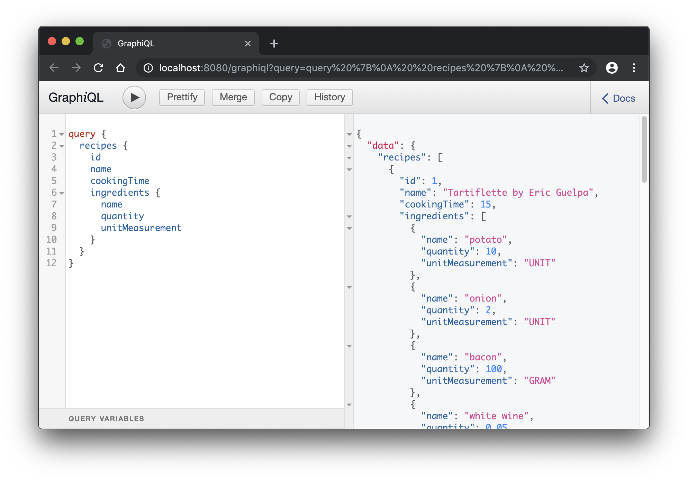
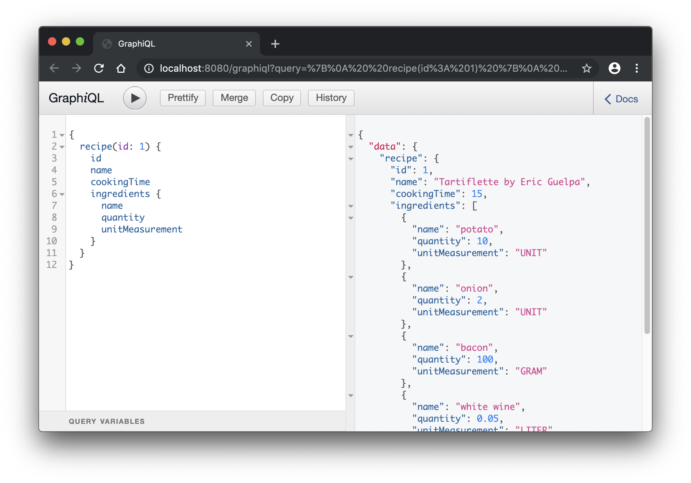
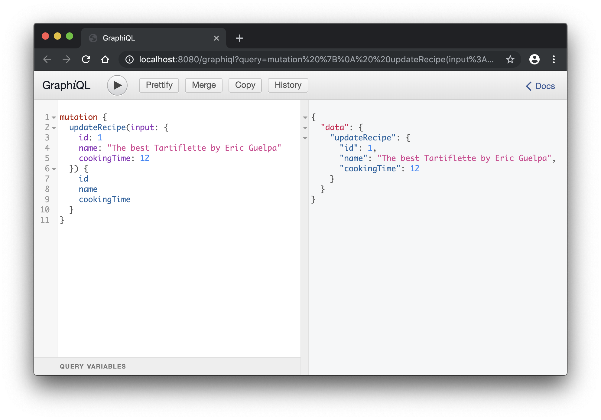
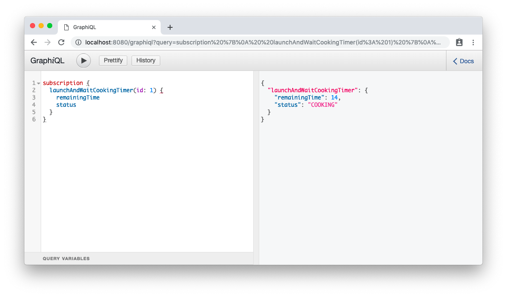
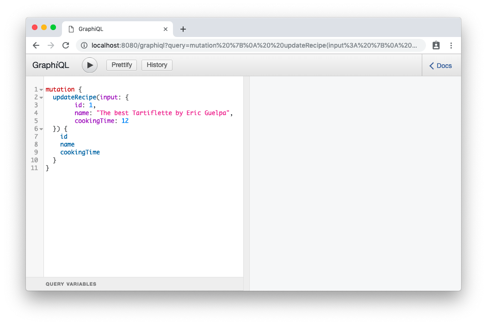

Simple GraphQL API Application
==============================

This application is a GraphQL backend to practice with API automated testing on localhost.

Setup
=====
1. `git clone git@github.com:brainly/python_simple_graphql_application.git`
2. navigate to project directory
3. run `pipenv install`
3. run `pipenv shell`
3. run `python -m recipes_manager` to start application
4. After an application is started, its should be available in URL `http://localhost:8080/graphiql`

Examples
========
1) Query all recipes

2) Query one recipe

3) Mutate recipe

4) Subscription session

4) Directives (validation)

